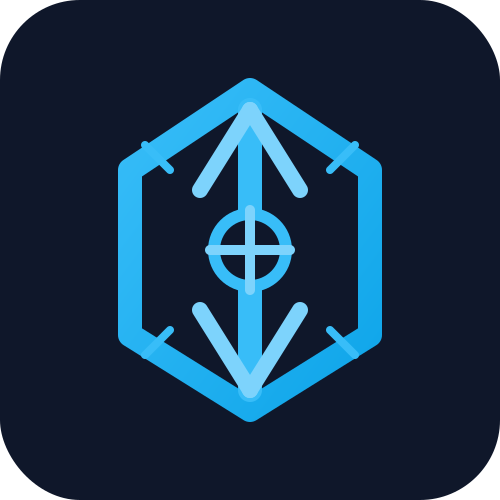

<p align="center">
  
</p>

# ᚺ Heimdall Gatekeeper

**Cloudflare-ready SIEM console** for event ingestion, alert management, webhook delivery, threat intelligence, and observability.


## Why Heimdall Gatekeeper

- **Serverless-ready SOC platform** built for Cloudflare Pages, Workers, and D1.
- **Real-time alerting** with JWT authentication and API-key event ingestion.
- **Webhook delivery** for Discord, Slack, and generic endpoints.
- **Threat intelligence support** with optional OTX, MISP, AbuseIPDB, VirusTotal, and Shodan.
- **Observability included** with Prometheus metrics and Grafana dashboard provisioning.

## Included Capabilities

- Event ingestion API with structured schemas.
- Alert triage lifecycle with acknowledge and resolve.
- Audit logging and webhook retry handling.
- Monitoring stack in `monitoring/` for Grafana, Prometheus, and Alertmanager.
- Cloudflare deployment automation and D1 migrations.
- Local testing with `pytest`.

## Quick start

### Local development

```bash
git clone https://github.com/Garcez7R/heimdall-gatekeeper.git
cd heimdall-gatekeeper
python3 -m venv .venv
source .venv/bin/activate
pip install -r requirements.txt -r requirements-dev.txt
cp .env.example .env
```

## Live dashboard usage

- Open the frontend at `http://127.0.0.1:8000` once the backend is running.
- Use `Overview` to monitor event throughput, alert queue status, and source distribution.
- Use `Alerts` to review, acknowledge, or resolve active detections.
- Use `Events` to search recent signals by type, source, and severity.
- Use `Status` to inspect engine health and inject sample events for live testing.
- When monitoring is active, open Grafana using the online Grafana URL configured for your deployment.

Read the detailed usage notes in [`TUTORIAL.md`](TUTORIAL.md).

Set required secrets in `.env`:
- `HEIMDALL_JWT_SECRET`
- `HEIMDALL_API_KEY`

Launch locally:

```bash
uvicorn backend.api.main:app --reload
```

Open:
- Dashboard: http://127.0.0.1:8000
- API docs: http://127.0.0.1:8000/docs
- Health: http://127.0.0.1:8000/api/system/health

### Run tests

```bash
pytest tests/ -q
```

## Cloudflare deployment

### Prerequisites

```bash
npm install -g wrangler
wrangler login
```

Export deployment secrets:

```bash
export CF_ACCOUNT_ID="<your-account-id>"
export CF_API_TOKEN="<your-api-token>"
export HEIMDALL_JWT_SECRET="<strong-jwt-secret>"
export HEIMDALL_API_KEY="<api-key>"
```

Store runtime secrets for Cloudflare Workers:

```bash
wrangler secret put HEIMDALL_JWT_SECRET
wrangler secret put HEIMDALL_API_KEY
```

Deploy with:

```bash
bash cloudflare/deploy.sh
```

Expected endpoints:
- Frontend: `https://heimdall-gatekeeper-frontend.pages.dev`
- API: `https://heimdall-gatekeeper.workers.dev`

## Observability

Heimdall includes a monitoring stack in `monitoring/`:

```bash
docker compose -f monitoring/docker-compose.monitoring.yml up -d
```

- Prometheus: `http://localhost:9090`
- Alertmanager: `http://localhost:9093`

If Grafana is available in a deployed environment, expose the public dashboard using `HEIMDALL_GRAFANA_URL`.

## Environment variables

Required:
- `HEIMDALL_JWT_SECRET` — JWT token signing secret.
- `HEIMDALL_API_KEY` — ingest API key triggered by `X-Heimdall-Key`.
- `CF_ACCOUNT_ID` — Cloudflare account ID.
- `CF_API_TOKEN` — Cloudflare API token for `wrangler`.

Optional threat intelligence keys:
- `OTX_API_KEY`
- `MISP_URL`
- `MISP_API_KEY`
- `ABUSEIPDB_API_KEY`
- `VIRUSTOTAL_API_KEY`
- `SHODAN_API_KEY`
- `HEIMDALL_GRAFANA_URL` — public Grafana URL to expose in the online dashboard

Optional SIEM integrations:
- `SPLUNK_HEC_URL`
- `SPLUNK_HEC_TOKEN`
- `ELASTICSEARCH_URL`
- `ELASTICSEARCH_API_KEY`
- `ELASTICSEARCH_USERNAME`
- `ELASTICSEARCH_PASSWORD`

## Notes

- Repository is cleaned of duplicate translation files and extra docs.
- No production secrets are stored in source control.
- Use `.env` locally and `wrangler secret put` for Cloudflare runtime values.
- The backend is aligned to use `HEIMDALL_JWT_SECRET` and `HEIMDALL_API_KEY` for authentication.

## License

All rights reserved.
